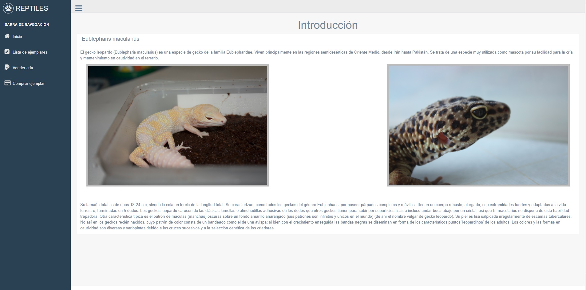
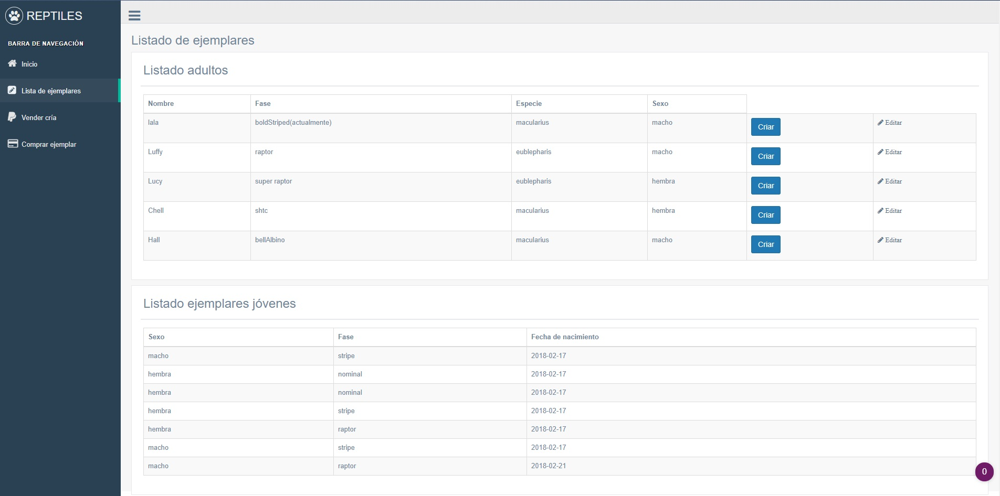
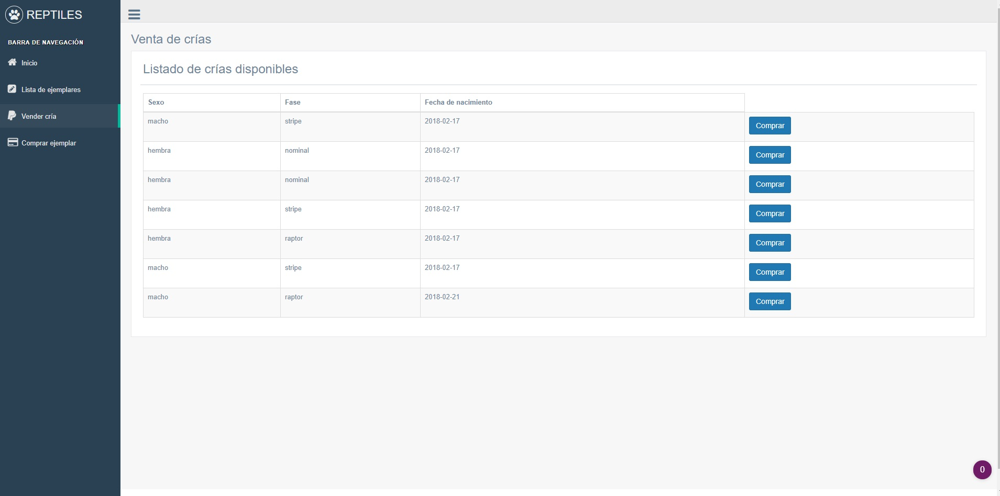
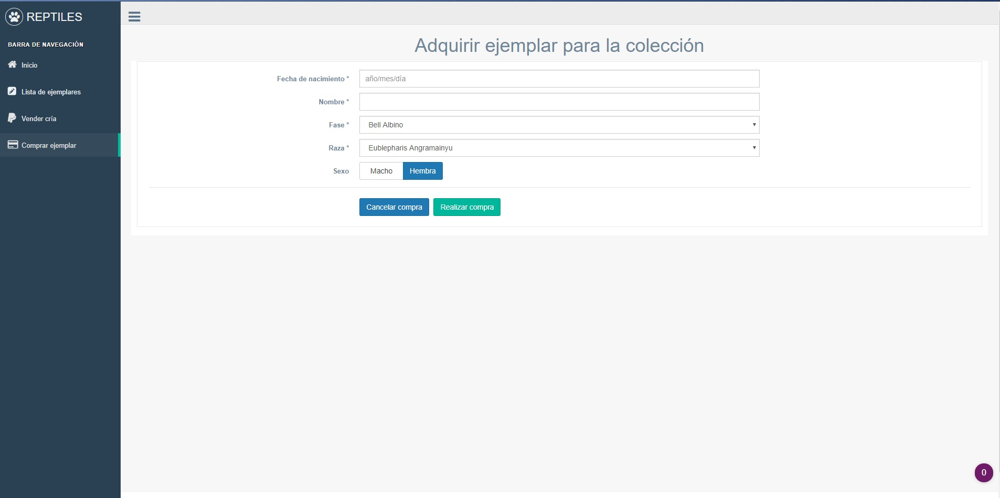

# ----TRABAJO CRUD----
## Información
-**Tema :** Crianza y venta de crías de reptiles.  
El trabajo constará de una base de datos con 3 tablas :
- Ficha Gecko
  - Código
  - Fase
  - Especie
  - Sexo
  - Nombre
  - Fecha de nacimiento
- Ficha crías
  - Código
  - Fase
  - Sexo
  - Estado
  - Propietario
- Ficha comprador
  - Código
  - Nombre
  - Apellidos
  - DNI

### Imágenes

